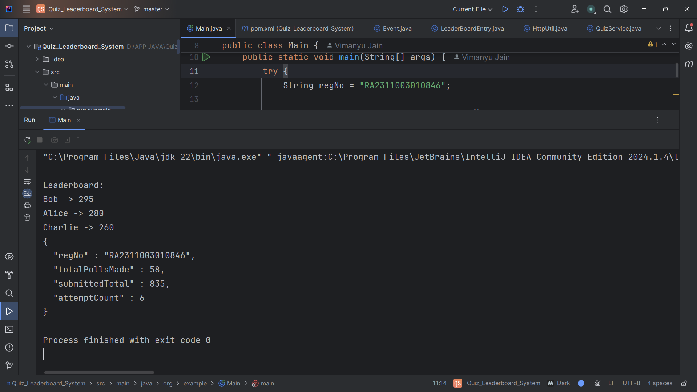
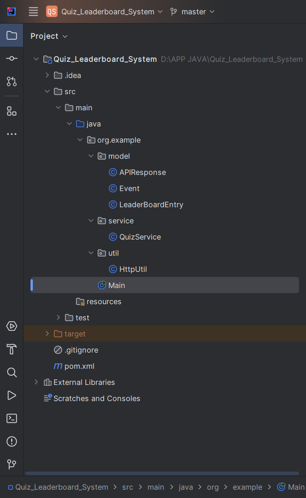
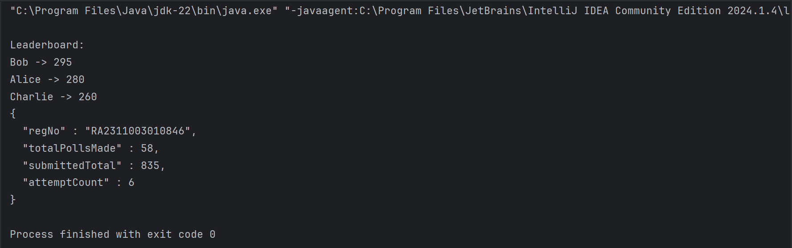

# Quiz Leaderboard System
A Java application that polls a quiz API, handles duplicate event data, 
and submits a ranked leaderboard.

## Problem Statement
Poll an external API 10 times, deduplicate events by `roundId + participant`, 
aggregate scores, and submit the final leaderboard.

## Tech Stack
1. Java 21
2. Jackson (JSON parsing)
3. Java HttpClient (built-in)
4. Maven

## How It Works
1. Polls `/quiz/messages` 10 times (poll 0–9) with a 5s delay between each
2. Each event is uniquely identified by `roundId_participant`
3. Duplicates are ignored using a `HashSet`
4. Scores are aggregated per participant
5. Leaderboard is sorted by total score (descending)
6. Final leaderboard is POSTed to `/quiz/submit

## Deduplication Logic
The same event can appear across multiple polls. 
To handle this, a `Set<String>` tracks seen keys in the format `roundId_participant`. 
`Set.add()` returns false if the key already exists — so duplicates are silently skipped.

# Deduplication Logic
The same event can appear across multiple polls. 
To handle this, a `Set<String>` tracks seen keys in the format `roundId_participant`. 
`Set.add()` returns false if the key already exists — so duplicates are silently skipped.

## Sample Output
Leaderboard:
Bob -> 295
Alice -> 280
Charlie -> 260
{
  "regNo" : "RA2311003010846",
  "totalPollsMade" : 48,
  "submittedTotal" : 835,
  "attemptCount" : 5
}

## Output Screenshots

